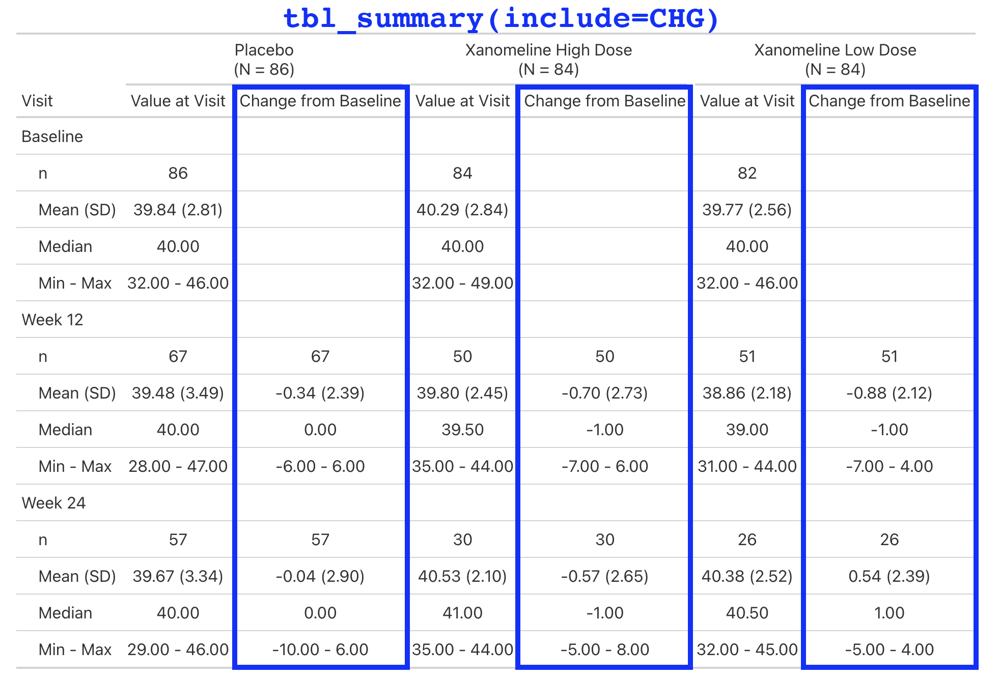

# Adopt {gtsummary}

## Adopt {gtsummary} with a company theme

-   A [theme]{.emphasis} is a set of customization preferences that can be easily set and reused.

-   Themes control [default settings for existing functions]{.emphasis}

-   Themes control more [fine-grained customization]{.emphasis} not available via arguments or helper functions

-   Easily use one of the [available themes]{.emphasis}, or [create your own]{.emphasis}

## {gtsummary} default theme

```{r}
#| output-location: "column"
reset_gtsummary_theme()

trial |> 
  tbl_summary(
    by = trt, 
    include = c(age, response)
  ) |>
  modify_caption(
    "Default Theme"
  )
```

## {gtsummary} theme_gtsummary_journal()

```{r}
#| output-location: "column"
reset_gtsummary_theme()
theme_gtsummary_journal(journal = "jama")

trial |> 
  tbl_summary(
    by = trt, 
    include = c(age, response)
  ) |>
  modify_caption(
    "Journal Theme (JAMA)"
  )
```

## {gtsummary} theme_gtsummary_language()

```{r}
#| output-location: "column"
reset_gtsummary_theme()
theme_gtsummary_language(language = "zh-tw")

trial |> 
  tbl_summary(
    by = trt, 
    include = c(age, response)
  ) |>
  add_p() |> 
  modify_caption(
    "Language Theme (Chinese)"
  )
```

**Language options:**

:::::: {.columns style="font-size:0.65em"}
::: {.column width="30%"}
-   German
-   English
-   Spanish
-   French
-   Gujarati
-   Hindi
:::

::: {.column width="30%"}
-   Icelandic
-   Japanese
-   Korean
-   Marathi
-   Dutch
:::

::: {.column width="30%"}
-   Norwegian
-   Portuguese
-   Swedish
-   Chinese Simplified
-   Chinese Traditional
:::
::::::

## {gtsummary} theme_gtsummary_compact()

```{r}
reset_gtsummary_theme()
theme_gtsummary_compact()

trial |> 
  tbl_summary(
    by = trt, 
    include = c(age, response)
  ) |>
  modify_caption("Compact Theme")
```

*Reduces padding and font size*

Learn more at [http://www.danieldsjoberg.com/gtsummary/articles/themes.html](http://www.danieldsjoberg.com/gtsummary/articles/themes.html)

## Wrapping Functions 

The first function we added to {crane} was `tbl_roche_summary()`: a *very thin* wrapper for `gtsummary::tbl_summary()`.

::: small
-   Continuous variables default to `continuous2`.

-   `tbl_summary(missing*)` arguments have been changed to `tbl_roche_summary(nonmissing*)`.

    -   We highlight non-missing counts over missing counts, which are the default in {gtsummary}

-   Counts represented by `0 (0%)` print as `0`.
:::

```{r}
#| label: tbl-roche-summary
#| output-location: slide
library(crane)

adsl |> 
  dplyr::mutate(ETHNIC = forcats::fct_expand(ETHNIC, "REFUSED")) |> 
  tbl_roche_summary(
    by = ARM2, 
    include = c(AGE, ETHNIC),
    nonmissing = "always"
  )
```

## Extending with New Functions 

::: small
Lab values are summarized by visit and include the change from baseline.

This is a simple table that is just a `tbl_merge()` of the `AVAL` summary and the `CHG` summary.

But the general structure appears enough times in our catalog, we make it simple for our programmers to create.
:::

```{r}
#| label: tbl_baseline_chg
#| eval: false
library(crane)

adlb |> 
  dplyr::filter(PARAM == "Albumin (g/L)") |> 
  tbl_baseline_chg(
    by = "ARM",
    baseline_level = "Baseline",
    denominator = adsl
  )
```

## Extending with New Functions 

{fig-align="center" width="80%"}

## Extending with New Functions 

{fig-align="center" width="80%"}

## Extending with New Functions 

{fig-align="center" width="80%"}

## Extending with New Functions 

{fig-align="center" width="80%"}

## Create a Company Theme 

Our theme is implemented in `crane::theme_gtsummary_roche()`

Primary changes include:

-   Sets a custom function for [rounding percentages]{.emphasis}.

-   Round all [p-values]{.emphasis} to four decimal places.

-   [Headers]{.emphasis} default to include the N in parenthesis _without_ bold, e.g. `'Placebo  \n (N = 184)'`.

-   All tables are printed with [{flextable}]{.emphasis} and we add Roche-specific styling to the table.

    -   Update the default [font, font size, table borders, cell padding, etc.]{.emphasis} to meet our guidelines.

## Create a Company Theme 

```{r}
#| output-location: column
theme_gtsummary_roche()

adsl |> 
  dplyr::mutate(ETHNIC = forcats::fct_expand(ETHNIC, "REFUSED")) |> 
  tbl_roche_summary(
    by = ARM2, 
    include = c(AGE, ETHNIC),
    nonmissing = "always"
  )
```

## Extend with ARD-first Functionality 

- We don't have time to cover in detail, but there is another wonderful way to create bespoke tables and functions.

- The {gtsummary} package supports creating tables using ARDs (Analysis Results Datasets).

    - Data ➡️ ARD ➡️ Table

- This method is particularly useful for efficacy tables, as they contain statistics that are not our standard rates, counts, and univariate descriptor statistics.

- Review the [ARD-first Vignette](https://www.danieldsjoberg.com/gtsummary/articles/tbl_ard-functions.html) for a detailed walk through.

## Extend with ARD-first Functionality 

```{r}
#| echo: false
reset_gtsummary_theme()
```

```{r}
tbl_survfit_times(
  data = adtte_onco |> 
    mutate(ARM2 = word(ARM, 1)), 
  times = 12, 
  by = "ARM2", 
  label = "Month {time}"
)
```

::: aside
If you prefer not to make an ARD first, you can also just create a data frame of a table and convert it to {gtsummary} and style it from there.
:::


